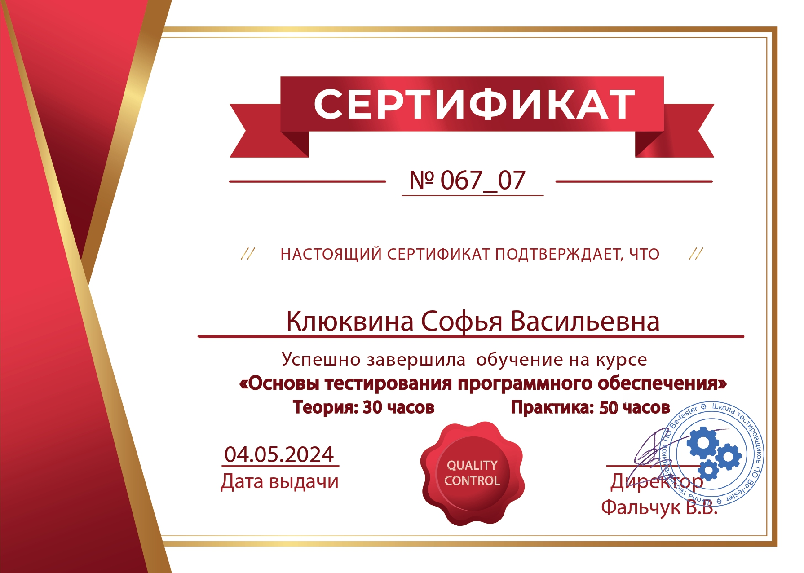

### Hello 👋
I continue to develop my skills and am currently actively studying software testing. My educational experience in data analytics courses has given me solid knowledge in Python, SQL, mathematical statistics, probability theory, product metrics, and product development frameworks.

I particularly want to highlight my experience working with marketplaces, where I used Selenium for data scraping. I then applied this knowledge to further explore automated testing. Additionally, I have experience with Postman for API testing and YouTrack for task and bug management.

Currently, I am seeking opportunities in manual testing and plan to apply my knowledge in automated testing in the future.

## Certificates
 

## Contacts
Email: sofaklukvina@gmail.com

LinkedIn: https://www.linkedin.com/in/sofia-kliukvina-ab908823b/
