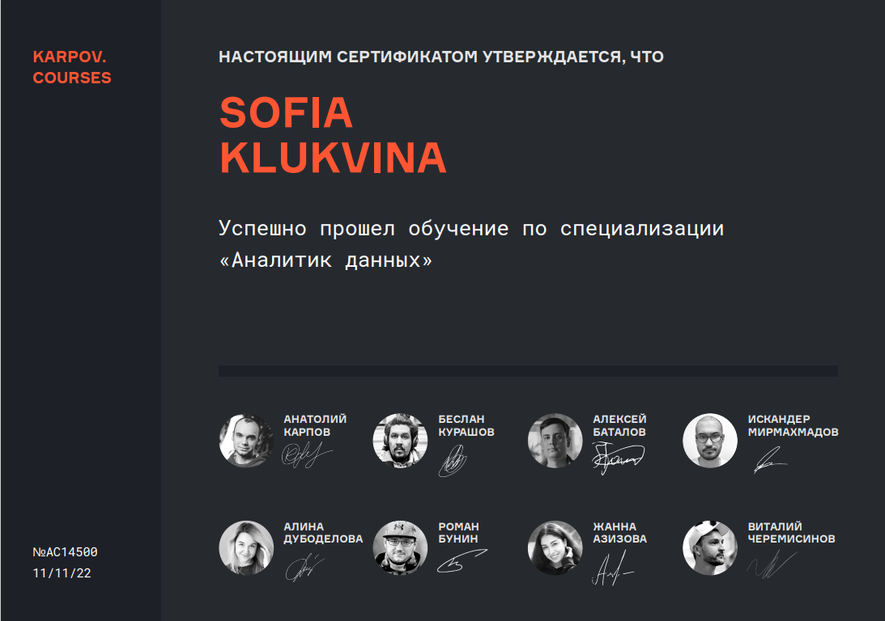

### Привет 👋

Я продолжаю развивать свои навыки и в настоящее время активно изучаю тестирование программного обеспечения. Мой учебный опыт на курсах по аналитике данных дал мне прочные знания в области Python, SQL, математической статистики, теории вероятностей, продуктовых метрик и фреймворков для развития продукта.

Особо хочу отметить свой опыт работы с маркетплейсами, где я использовала Selenium для парсинга данных. Эти знания я затем применяла для более глубокого изучения автоматизированного тестирования.

Сейчас я ищу возможности в области мануального тестирования и планирую в будущем применять свои знания в автоматизированном тестировании.

## Сертификаты

Вы также можете скачать мой сертификат [https://lab.karpov.courses/certificate/2cca25e5-4b54-4c64-980f-25cb3fea72ed/en/].

## Контакты

- Электронная почта: sofaklukvina@gmail.com
- LinkedIn: [https://www.linkedin.com/in/sofia-kliukvina-ab908823b/](https://www.linkedin.com/in/sofia-kliukvina-ab908823b/)
